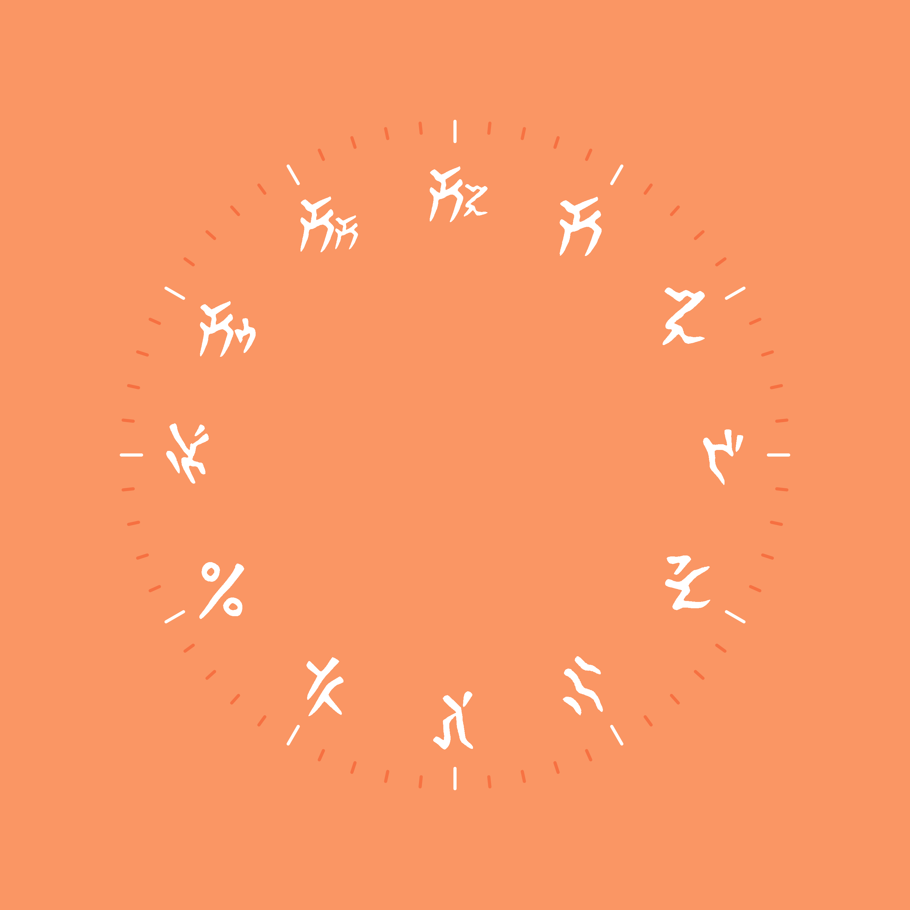

# La-Mulana Clock



change color in file `draw.html`
```html
<canvas id="output" style="max-height: 90vh;">

</canvas>
<button id="download" disabled>Download</button>

<script>
    const minute_marker_color = [244, 77, 31, 0.5];
    const hour_marker_color = [255, 255, 255, 1];
    const numberal_font_color = [255, 255, 255]; // La-Mulana numberal font color
    const background_color = [250, 150, 100];
...
```

- I don't want to add custom input for color, but html input don't support rgb**a**. so you need to change color in `draw.html`
